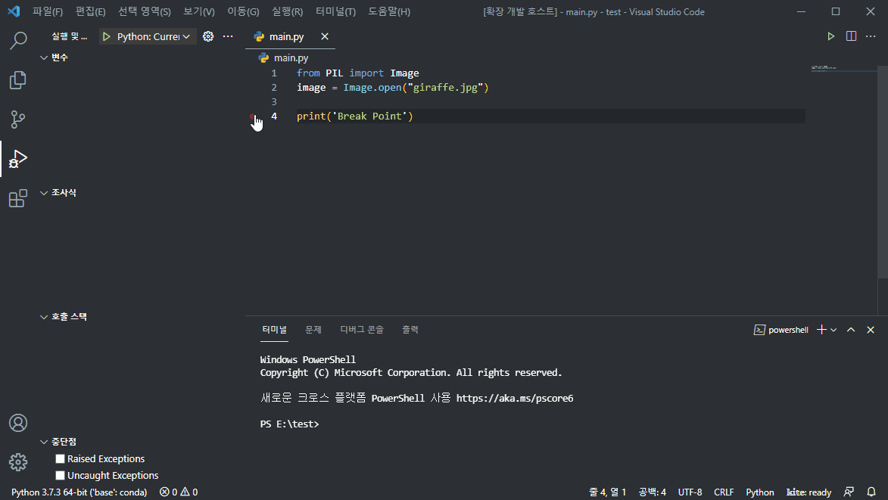
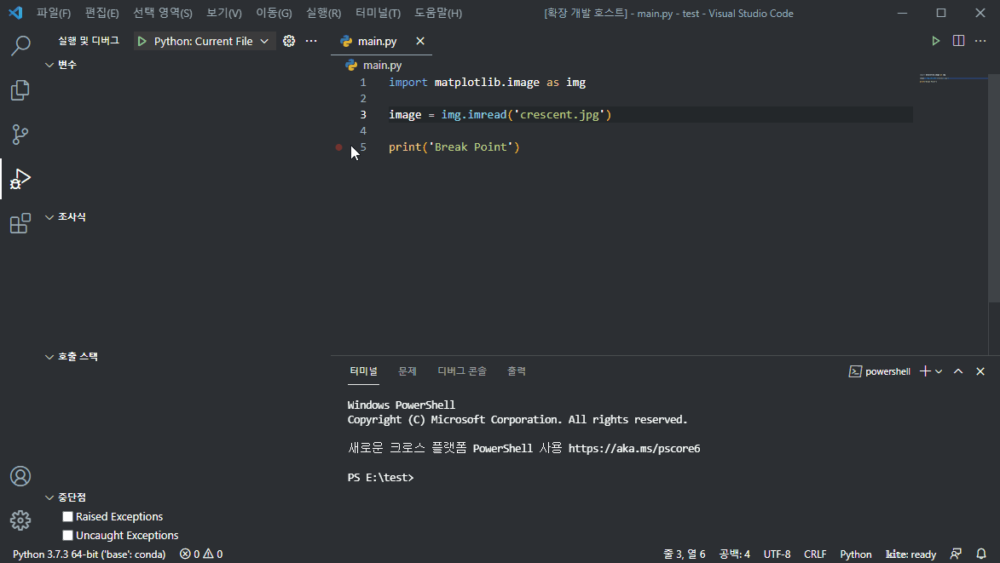

# Python Image Preview

You can quickly check your Python image data.

## Dependencies

Requires one or more of the following libraries:

- opencv-python
- pillow
- matplotlib

## How to use

1. Open Command Palette
	- Windows : Ctrl + P
	- MacOS : ⌘ + P
2. Run `Python Image Preview`
	- Enter `> Python Image Preview` on the command palette.

3. Insert breakpoint.

4. Debug Mode Start

### Apply OpenCV

### Apply PIL

### Apply matplotlib

## Authors

Daehee Yun(s076923@gmail.com)