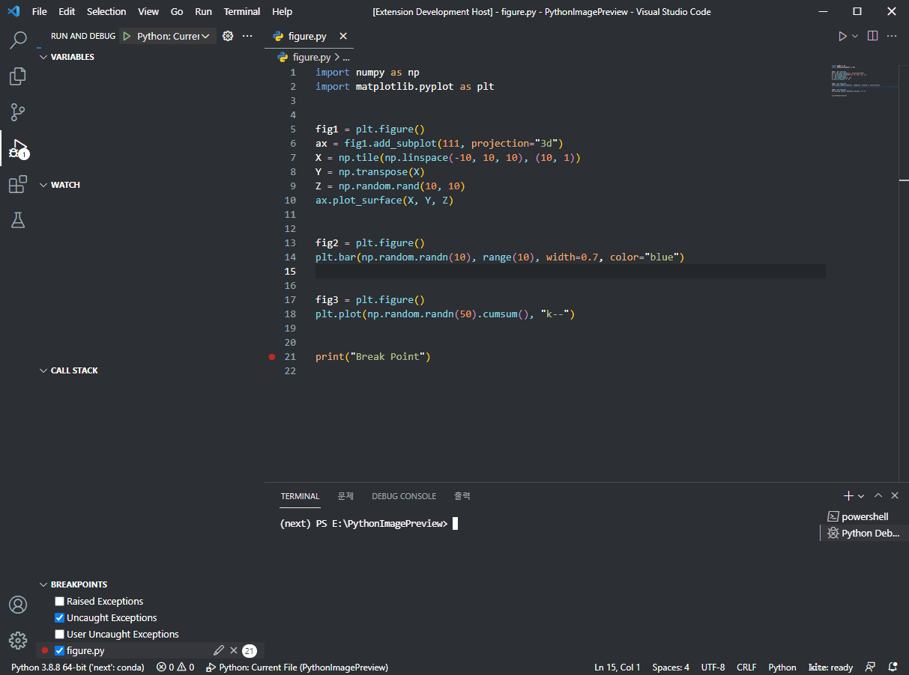
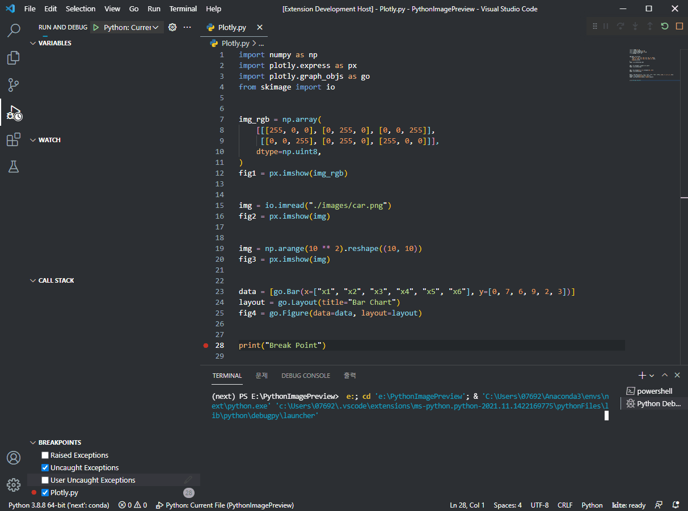

# Python Image Preview

You can quickly check your Python image data.

## Dependencies

Requires one or more of the following libraries:

- pillow
- opencv-python
- matplotlib
- image
- plotly + kaleido

## Supported Libraries

- numpy
- pillow
- opencv-python
- matplotlib
- imageio 
- tensorflow
- pytorch
- skimage
- plotly + kaleido
- etc.

## How to use

1. Set a `breakpoint` on the line of code.

2. `Debug Mode Start`

3. `Open Command Palette`
	- Windows : Ctrl + P
	- MacOS : ⌘ + P

4. Run `Python Image Preview`
	- Enter `> Python Image Preview` on the command palette.

5. Click on the variable.

 

### Apply Numpy

### Apply Pillow

### Apply OpenCV

### Apply Matplotlib

### Apply Matplotlib PyPlot

### Apply Plotly

### Apply ImageIO

### Apply Scikit Image

### Apply Tensorflow

### Apply Pytorch

## Authors

Daehee Yun(s076923@gmail.com)