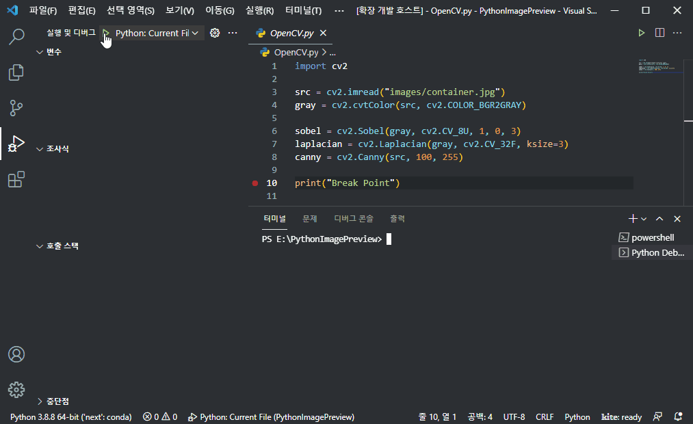

# Python Image Preview

You can quickly check your Python image data.

## Dependencies

Requires one or more of the following libraries:

- opencv-python
- pillow
- matplotlib

## How to use

1. Set a `breakpoint` on the line of code.

2. `Debug Mode Start`

3. `Open Command Palette`
	- Windows : Ctrl + P
	- MacOS : ⌘ + P

4. Run `Python Image Preview`
	- Enter `> Python Image Preview` on the command palette.

5. Click on the variable.

### Apply OpenCV

### Apply PIL

### Apply Matplotlib

## Authors

Daehee Yun(s076923@gmail.com)